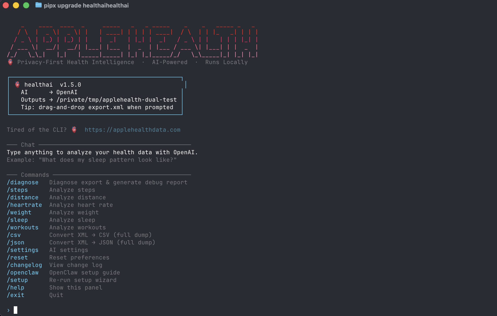

# 🫀 healthai — Apple Health AI Analyzer

**A terminal AI assistant for your Apple Health data. Chat with 8 years of personal health metrics using any LLM — local or cloud.**

[](https://github.com/krumjahn/applehealth/stargazers)
[](LICENSE)
[](https://www.python.org/downloads/)
[](https://pypi.org/project/healthai/)
[](https://ollama.com/library/deepseek-r1)
[](https://clawhub.ai/krumjahn/apple-health-export-analyzer)



---

## Installation

```bash
curl -fsSL https://raw.githubusercontent.com/krumjahn/applehealth/main/install.sh | bash
```

Or install directly with pipx:

```bash
pipx install healthai
```

Then run:

```bash
healthai
```

On first launch, a setup wizard walks you through choosing your AI model (GPT-4o, Claude, Gemini, DeepSeek-R1, and 50+ more), setting your API key, and pointing to your `export.xml`. Re-run it any time with `healthai --setup`.

### 🚀 **Prefer a GUI?**
Visit **[applehealthdata.com](https://applehealthdata.com)** for instant, interactive analysis without the terminal.

---

## 🧐 What is this?

A purpose-built CLI that turns your Apple Health `export.xml` into a conversational AI session. Think of it as having a personal health analyst in your terminal — one that knows your exact data and can answer questions, spot trends, and generate charts without sending anything to a third party unless you choose to.

It's built for developers, biohackers, and researchers who want **full control** over their health data pipeline.

## ✨ Key Features
- 💬 **Chat REPL**: Ask questions in plain English. `"What were my most active months last year?"` — just type it.
- 🧠 **50+ AI Models**: GPT-4o, Claude, Gemini, DeepSeek-R1, Grok, Mistral, Llama, and any Ollama local model.
- 🔒 **100% Private Mode**: Run DeepSeek-R1 or Llama 3 locally via Ollama — no data leaves your machine.
- 📊 **Automated Charts**: Heart rate cycles, sleep patterns, workout intensity — generated with one slash command.
- 📤 **High-Fidelity Export**: XML → CSV/JSON preserving all metadata (Record, Workout, ActivitySummary).
- 💍 **Smart Ring Integration**: Unified view of **Oura**, **Whoop**, and **Samsung Ring** data via Apple Health sync.
- 🔄 **WHOOP Integration**: Specialized support for augmenting Apple Health data with WHOOP metrics.

## 💬 Chat with Your Health Data

After setup, `healthai` drops you into a chat interface. Just type naturally:

```
  🫀 healthai  v1.5.0
  AI      → OpenAI (ChatGPT)
  Outputs → ~/healthai_output

  › What were my most active weeks last year?
  › How does my sleep correlate with my workout intensity?
  › Show me my heart rate trends over the past 3 months
```

Slash commands handle data operations:

| Command | Description |
|---|---|
| `/diagnose` | Full health data report across all metrics |
| `/steps` | Analyze step count trends |
| `/heartrate` | Heart rate trends and anomalies |
| `/sleep` | Sleep duration and quality patterns |
| `/workouts` | Workout history and intensity |
| `/weight` | Weight and BMI trends |
| `/csv` | Export all metrics to CSV |
| `/json` | Export all metrics to JSON |
| `/settings` | View and change AI provider |
| `/setup` | Re-run the setup wizard |
| `/help` | Show all available commands |
| `/exit` | Quit |

## 🛠️ "Steal My System": From 8 Years of Data to Actionable Training
I used this exact tool to analyze 8 years of my own fitness history. Here's the system:
1. **The Pattern**: I discovered that my most active days (40k+ steps) almost never coincided with gym sessions—they were work-related.
2. **The Optimization**: I used the AI Analyzer to identify "Heart Rate Cycles" (3-4 week recovery dips) to automate my deload weeks.
3. **The Result**: A training plan that finally matches my biology instead of a generic app's schedule.
[Read the full case study here](https://rumjahn.com/how-i-used-a-i-to-analyze-8-years-of-apple-health-fitness-data-to-uncover-actionable-insights/).

## ⚡ Quick Start

**Recommended (install once, run anywhere):**
```bash
curl -fsSL https://raw.githubusercontent.com/krumjahn/applehealth/main/install.sh | bash
healthai
```

**Or clone and run directly:**
```bash
git clone https://github.com/krumjahn/applehealth.git && cd applehealth
./run
```

**For private local AI (DeepSeek-R1, free, no API key):**
1. Install [Ollama](https://ollama.ai) and run `ollama pull deepseek-r1`.
2. Launch `healthai`, choose **Ollama** in the setup wizard.

## 🦞 OpenClaw Support

This repo now has a published OpenClaw skill:

**[Install from ClawHub: Apple Health Export Analyzer](https://clawhub.ai/krumjahn/apple-health-export-analyzer)**

What OpenClaw does for normal users:
- check your Apple Health data quickly
- turn it into a short daily health brief
- give you simple daily tips on how to improve

The skill now supports two sources:
- the `Health Data AI Analyzer` Mac app if its local API is available
- this open-source `applehealth` export.xml workflow as a fallback

For the Mac app path, the public skill now uses read-only localhost OpenClaw endpoints and does not need to read a local token file.

If you want to use the Mac app path in a restricted OpenClaw session, run the one-time companion installer:

```bash
git clone https://github.com/krumjahn/applehealth.git
cd applehealth
python skills/apple-health-export-analyzer/scripts/install_mac_app_companion.py --restart
```

Then use the companion skill:

```text
Use the health-analyzer-mac-local skill. Give me my daily health brief for today and 3 suggestions.
```

Use it if you want OpenClaw to:
- verify your Apple Health export setup
- generate a daily health brief from `export.xml`
- compare your steps and sleep over the last 7 days
- create a weekly summary with workouts and heart rate context
- help you set up a recurring daily health message

Example output:

```text
Status
- Today was a low-activity day relative to your recent baseline.

What changed
- Steps: 2,431 vs 7-day baseline 9,993
- Workouts: 0 minutes, 0 workouts
- Sleep: insufficient data

Suggestions
1. Add one easy walk today instead of trying to catch up with a hard workout.
2. Use one fixed movement anchor, like a walk after lunch.
3. Keep effort moderate when recovery data is missing.
```

Example prompts:

```text
Use the Apple Health Export Analyzer skill. Verify my setup and give me my latest daily health brief with 3 suggestions.

Use the Apple Health Export Analyzer skill. Compare my steps and sleep over the last 7 days.

Use the Apple Health Export Analyzer skill. Generate a weekly summary from my Apple Health export.
```

## 🤖 Instructions for AI Agents
*If you are an AI Agent (Claude Code, Windsurf, OpenClaw) helping a user analyze health data:*
1. Clone this repo into the user's workspace.
2. Direct the user to place their `export.xml` in the root.
3. Call `python src/applehealth.py --export ./export.xml --out ./analysis` to generate the CSV datasets.
4. Read the resulting `.csv` files to provide personalized medical/fitness coaching.

### 🦞 Local OpenClaw Workflow

```text
skills/apple-health-export-analyzer
```

The skill includes concrete scripts for:
- verifying the local repo and `export.xml` setup
- generating a daily Apple Health brief
- comparing recent step and sleep trends
- generating a weekly summary

Example:

```bash
python skills/apple-health-export-analyzer/scripts/check_setup.py --repo /path/to/applehealth --export /path/to/export.xml --out /path/to/analysis
python skills/apple-health-export-analyzer/scripts/daily_brief.py --repo /path/to/applehealth --export /path/to/export.xml --out /path/to/analysis
```

## 📋 Requirements & Tech Stack
- **Language**: Python 3.9+
- **Data**: Pandas, XML.ElementTree
- **Viz**: Matplotlib
- **AI**: OpenAI, Anthropic, Google, Ollama, LiteLLM, and more

## 🐳 Docker (The "No-Setup" Way)
If you have Docker installed, you can run the analyzer without installing Python or dependencies locally:

```bash
# 1) Build the image
docker build -t applehealth .

# 2) Run the container (mount your export.xml and an output folder)
docker run -it \
  -v "/path/to/your/export.xml:/export.xml" \
  -v "$(pwd)/out:/out" \
  applehealth
```

## 🌟 Charts & Output Examples

https://github.com/user-attachments/assets/98ad8fc3-ed1d-4395-80c5-eb66a8cceb61


## 🤝 Contributing & Community
Join our community of builders! If you improve the parser or add a new visualization, please submit a PR.

**[Join my community](https://nas.io/rumjahn)** for updates, experiments, and AI-builder workflows.

---
If you find this tool useful, **please give it a star ⭐️** to help others find it!

[](https://star-history.com/#krumjahn/applehealth&Date)
